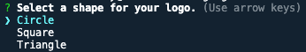

 # Logo-generator

## Description

I have created a command-line application that, given specific user input, will generate a svg logo into a file titled 'logo.svg' based on the user prompts. 

## Installation

This application uses node.js to run. Please make sure you have it installed before trying to run the application. You can find a link to node.js [here](https://nodejs.org/en).

This application uses the Inquirer package as a way to display the questions to the user, and validate-color package as a way to validate the user as entered in is valid input for the colours. Both of these have already been loaded into the dependecies of the package.json file. 

To run the application:
1. Right click the index.js file and click 'open in integrated terminal' or if you code editor does not have this function then you can use your terminal and make sure you are giving it the right file path.
2. Type "npm install" into the terminal to load in the npm packages.
3. Type "node index.js" to start the application.

## Usage

Once you have opened up the terminal to the path corresponding to the application (see installation section for how to do this), type "node index.js" and press enter to run the application. 

You will then be prompted with several questions to answer. 

When you come across the question about what shape you want, please note that this is a list that you can scroll down with the up and down arrow. Press enter when you are on the shape you want.

If there is certain criteria to be met for an input, it will be stated in the question. If invalid input is entered, you will see an error message at the command line. 

You will not be allowed to continue to the next question until valid input is entered. Once all questions are answered you will see a message in the terminal "Generated logo.svg" to indicate that the file creation has been successful. If there has been an issue an error message will appear. You can then click on the “logo.svg” file to view the file.

 To see the logo that the svg file generates, right click on the "logo.svg" file and select either "Open in Live Server" or "Copy Path" and then paste the path in your internet browser address bar. Your generated logo will look something like this

A video of the usage of this application can be found [here](https://drive.google.com/file/d/1DnHAayOfcL5ueMjZzb1cm5sDnwus_fSZ/view).

## Tests

There are several tests written to test the shapes.js file to ensure that it is giving the correct input when a shape is selected by the user. These tests have been written with Jest. To run the test yourself, simply type "npm run test" into the command line.

